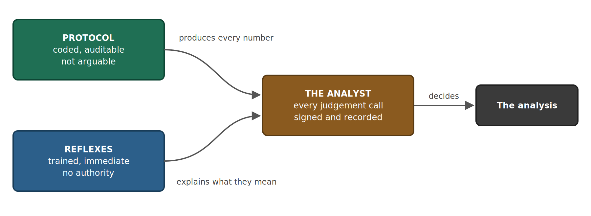
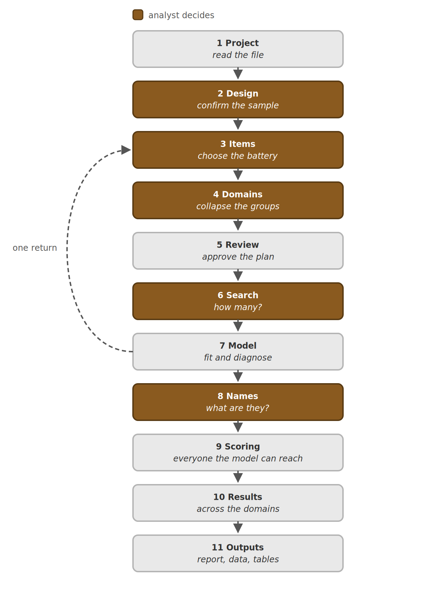

# DrSvyR

**A survey methodologist you can consult, working on data you already have.**

Finding groups inside a battery of survey questions, with standard errors that
respect how the sample was actually drawn — and a record of who decided what.

You do not need to write any R. You do need to know your survey.

---

## What DrSvyR is, and is not

The tool has an AI methodologist in it. It is worth being exact about what that
means, because the obvious reading — an AI that does the analysis — is wrong.

**Protocol** is what the workflow does regardless of anyone's opinion. A stratum
with one sampling unit halts the analysis. The classification table is rebuilt
inside every replicate. The log-likelihood is rescaled before BIC is computed. A
ranking is never reported as a test. No respondent record ever reaches the
model. The analyst enters their chosen number *before* the model offers a view.
None of these are instructions a model follows — they are conditions of the code
running at all, and you can read them in the source.

**Reflexes** are what DrSvyR notices and says. It sees an entropy of 0.71 and
says what that means for your decision; it sees a design effect of two and
flags it. Trained, immediate, occasionally wrong — and attached to no authority
whatsoever. A reflex is a reaction, not a decision. Nobody was ever compelled by
someone else's reflex.

**The analyst signs.** Which items form a battery, how many groups, whether a
name fits the profile, which category is the reference, whether an item comes
out. Every one of those is recorded with the evidence that was on screen at the
time, in a decision log that ships with the results.

DrSvyR diagnoses and recommends. It does not prescribe, and it cannot overrule.

---

## What the analysis does

You have a battery of related questions and want to know how respondents differ
on it. This tool answers one version of that question: **do they fall into a
small number of distinct types, each with its own way of answering the set?**
Some agree with these items and reject those; others do the reverse. The result
is a **segment** for each respondent.

That is a latent class model, and it is the only model this tool fits.

**The other case, and what happens when you are in it.** Some batteries do not
work that way. If everyone sits somewhere on one scale from low to high —
differing in how much rather than in which — then a factor model describes them
and this one does not. Fit classes to a continuum and you get groups ordered low
to high that look like a finding and are an artefact of the model.

So the Items screen computes the evidence and the methodologist reads it. Where
the battery looks like a single continuum it says so plainly and names the model
that fits: a weighted confirmatory factor analysis, `lavaan::cfa()` with
`estimator = "WLSMV"` and `sampling.weights`, taking its standard errors from
the same stratified jackknife this tool uses rather than from the default
output. That is advice, not a gate — you can continue either way, and the
verdict is recorded in the report.

The factor arm was implemented and then archived, unfinished, in
`archive/cfa_arm.R`. Two known defects are listed at the top of that file and
must be fixed before any of it is used. Nothing in the app loads it.

**Why not just use standard software:** every standard error here comes from the
survey design — the stratification, the clustering, the weights — carried from
the measurement model through to the group estimates without interruption.
Defaults elsewhere assume a simple random sample and report intervals around
half the size they should be. Differences that look decisive under those
defaults often are not.

---

## The workflow

Amber steps are the ones you decide. Nothing runs until you press a button.

**The gate that matters most is step 6.** You see the evidence — the criteria,
and a picture of what the groups actually look like at each candidate size —
and you enter a number. Nothing is pre-filled and nothing is suggested, because
whatever appeared in that box first would become the answer. Only after your
choice is recorded does DrSvyR say what it makes of the evidence. If that
changes your mind, enter a different number; both are in the log.

**On the Items screen**, once you have a research question and at least three
items, *What else might belong here?* hands the methodologist your question,
your chosen battery, and every remaining variable's question wording, and asks
which ones cover a facet the battery misses. It has seen no respondent's
answers and is told so. Each suggestion is then scored by R — categories,
missingness, how concentrated the modal answer is, and how much it shares with
the items you chose — and the reasoning sits beside the numbers that test it.
Nothing is added automatically. You put items in yourself and press Summarise
again.

---

## What you need

- A survey file, **SPSS (.sav)** or **Stata (.dta)**.
- The technical report for that survey, as a **PDF**, if you have one.
- Design variables in the file: a **weight**, a **stratum**, a **primary
  sampling unit**, and a **respondent id**. This is for stratified clustered
  designs; weights alone are not enough.
- A few hundred completed interviews or more.

---

## Setup, once

1. **Clone this repository** and open `DrSvyR.Rproj` in RStudio.
2. **Install the packages**: `source("setup.R")`. It installs only what is
   missing, and the file records why each package is there and why several
   obvious ones are deliberately absent.
3. **Add your API key.** `usethis::edit_r_environ()`, add one line —
   `OPENROUTER_API_KEY=your-key-here` — save, restart R. That is the only thing
   that goes in there. On a shared server you can instead paste a key on the
   Start here tab, where it lives for the length of your session, is never
   written to disk, and is never visible to another session.
4. **Create a work folder** outside the repository. Outputs, the decision log
   and cached fits are written there, and the app refuses a folder inside the
   clone. Your survey file is only ever read, so it can stay wherever it
   already is.

Then click **Run App**.

---

## What you get

In your work folder, under `output/`:

- **A report** — the findings, the groups and what they mean, the distribution
  across your domains, and the caveats attached to the numbers they belong to.
  A single self-contained HTML file with every figure embedded, which opens in
  Word if a document is what somebody wants. Reviewed on screen before anything
  is written.
- **Your survey file back**, with segment membership added, plus the posterior
  columns needed to use it correctly.
- **Every table as a CSV**, ready to paste.
- **A decision log** — each choice you made and the evidence you had when you
  made it.

---

## The protocol, in full

The list a methodologist should audit. Each of these is enforced in code, and
none of them can be turned off from the interface.

| | |
|---|---|
| A stratum with one sampling unit halts the design | It cannot take the replicate scaling, and continuing would contribute zero variance from the strata carrying least information |
| Missing or non-positive weights halt the run | Different estimators silently disagree about who is in the sample |
| The classification table is rebuilt inside every replicate | Holding it fixed treats classification error as known |
| A singular classification table halts rather than being inverted anyway | It means a segment took no assignments in some replicate, which is a finding about the model |
| The log-likelihood is rescaled before BIC | Without it the criterion leans toward too many groups |
| Rankings are never reported as tests | Bivariate residuals order item pairs; no reference distribution applies |
| No respondent record reaches the model | It sees variable names, question wording, response labels and aggregates |
| The dimension is entered before any interpretation is offered | Presentation order is what makes the choice the analyst's |
| Names are keyed to the specification that produced them | Change the battery and the saved names refuse to load rather than reattach to different groups |
| Item removal is capped at one round, and the count is printed in the report | Fit statistics after a specification search are optimistic, and a reader cannot discount what they are not told |
| Failed replicates are counted and disclosed | Dropping them understates variance rather than merely widening it |
| Domain estimates are read through `coef()` and `SE()` | A positional read of an `svyby` result returns a number of the right shape from the wrong column, and a column count cannot detect it |

---

## Testing it without running it

`tests/` holds two scripts that need no survey file, no API key and no browser.

- `Rscript tests/parse_check.R` — one second. Every file still parses.
- `Rscript tests/test_pipeline.R` — about two minutes. The whole pipeline on
  synthetic data: design, search, fit, diagnostics, replicate variance,
  scoring, domains, the bias correction, and the guards that turn a silent
  wrong number into a message. It also asserts that no removed function is
  still called anywhere, which is the failure R does not report until the line
  runs.

Run both before changing anything and after.

---

## Limitations

- **The analysis assumes each question works the same way in every group being
  compared, and does not test it.** If an item means something different to
  younger and older respondents, or in one region than another, a difference
  between those groups may reflect the question rather than the thing being
  measured. Testing this is measurement invariance analysis — homogeneity of
  item-response probabilities across groups — and it is not implemented here.
  Where there is reason to suspect it, consult a survey methodologist trained
  in psychometrics before treating a domain difference as substantive.
- Requires a stratified clustered design.
- **Domain intervals hold the measurement model fixed.** The classification
  table is recomputed in every replicate; the posteriors and the assignment are
  not. This is standard three-step practice and it makes the intervals
  optimistic. On the reference implementation, propagating that uncertainty
  multiplied the corrected standard errors on one demographic by a median of
  2.17.
- Variance is within-mode: it expresses design variance around the reported
  solution, not uncertainty about which mode the likelihood should have found.
- Fit statistics reported after removing an item are optimistic. The number of
  rounds appears in the report.
- Drafted names are drafts. No claim is made about their validity.

---

## Method

The full specification — every formula, every diagnostic, what was verified
against what, and what remains untested — is
`methodology_v1.0.pdf`, written for both a manager and a survey statistician
and shipped with every set of results.

Worked examples on public data, running the same engine end to end, are in the
[weighted_inference_survey_estimation](https://github.com/klinares/weighted_inference_survey_estimation)
repository.

## Data acknowledgment

The demonstration uses the 2023 AmericasBarometer for Ecuador by the LAPOP Lab
at Vanderbilt University.
